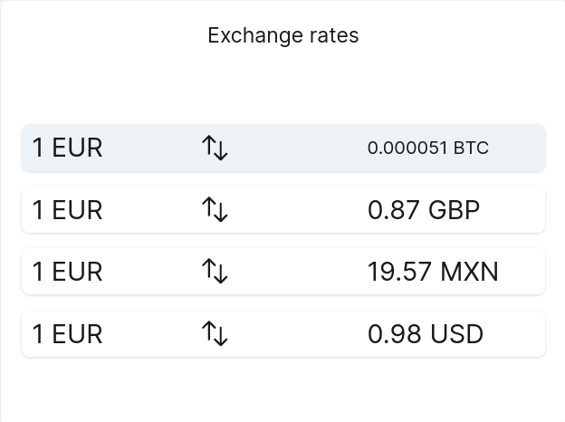
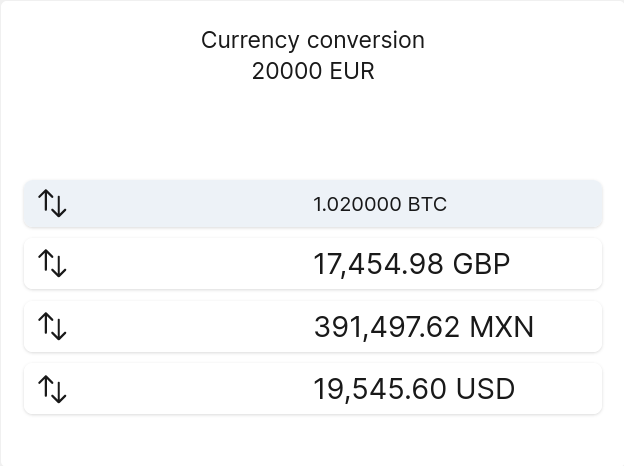

# Exchange rates display for your laravel dashboard.

[](https://packagist.org/packages/VictorAvelar/laravel-dashboard-exchange-rates-tile)
[](https://github.com/VictorAvelar/laravel-dashboard-exchange-rates-tile/actions?query=workflow%3Arun-tests+branch%3Amaster)
[](https://packagist.org/packages/VictorAvelar/laravel-dashboard-exchange-rates-tile)

It allows you to display a list of selected currencies and it's exchange rate to a base currency of your choice.

This tile can be used on [the Laravel Dashboard](https://docs.spatie.be/laravel-dashboard).

## Installation

You can install the package via composer:

```bash
composer require VictorAvelar/laravel-dashboard-exchange-rates-tile
```

## Usage

#### Exchange rates tile

Depending on your provider, this tile will show the most recent exchange rate for the symbols listed in your configuration.

In your dashboard view you use the `livewire:dashboard-exchange-rates-tile` component.

```html
<x-dashboard>
    <livewire:exchange-rates-tile position="a1" />
</x-dashboard>
```

##### Example



#### Exchange rate converter

The conversion of a certain amount in your base currency to each symbol in your configuration is displayed on this tile.

In your dashboard view you use the `livewire:dashboard-exchange-converter-tile` component.

```html
<x-dashboard>
    <livewire:exchange-converter-tile position="a1" />
</x-dashboard>
```

##### Example



#### Fetching exchange rates

In `app\Console\Kernel.php` you should schedule the `Avelar\ExchangeRates\UpdateCurrencyExchangeRatesCommand` to run. 

```php
// in app/console/Kernel.php

protected function schedule(Schedule $schedule)
{
    // ...
    $schedule->command(Avelar\ExchangeRates\UpdateCurrencyExchangeRatesCommand::class)->everyMinute();
}

```

#### Customzing the views

```bash
php artisan vendor:publish --provider="Avelar\ExchangeRates\ExchangeRatesTileServiceProvider" --tag="dashboard-exchange-rates-views"
```

### Configuration

```php
// in config/dashboard.php

return [
    // other settings
    'tiles' => [
        // other tiles ...
        'exchange_rates' => [
            /*
            |--------------------------------------------------------------------------
            | Exchange rates provider.
            |--------------------------------------------------------------------------
            |
            | Value for the exchange rates provider you prefer to use, the tile was
            | build using exchangerate.host which is free but it is also fully 
            | compatible with fixer.io which has a freemium model.
            |
            | Accepted values are: "exchangerates.host" and "fixer.io".
            |
            */
            'provider' => 'exchangerate.host',

             /*
            |--------------------------------------------------------------------------
            | Base currency.
            |--------------------------------------------------------------------------
            |
            | The currency you want to use as base for the exchange rates display.
            |
            | Any currency is accepted as base as long as it is supported by your
            | exchange rate provider.
            |
            */
            'base' => 'EUR',
            
            /*
            |--------------------------------------------------------------------------
            | Symbols to track.
            |--------------------------------------------------------------------------
            |
            | An array of exchange rate(s) symbols you wish to track.
            |
            | Example: ['USD', 'JPY', 'MXN']
            |
            */
            'symbols' => ['GBP', 'USD'],
            
            /*
            |--------------------------------------------------------------------------
            | Crypto assets to track.
            |--------------------------------------------------------------------------
            |
            | An array of crypto assets(s) you wish to track.
            |
            | The support for this feature depends on the provider you are using and
            | the crypto exchanges/assets this provider tracks.
            |
            | Currently only exchangerates.host is available as crypto provider and 
            | the list of available assets can be found here:
            | https://api.exchangerate.host/cryptocurrencies
            |
            | Example: ['BTC']
            |
            */
            'crypto' => ['BTC'],

            /*
            |--------------------------------------------------------------------------
            | Fixer.io API key.
            |--------------------------------------------------------------------------
            |
            | When using fixer.io as provider you need to privide a valid API key
            | in order to access the API.
            |
            */
            'api_key' => env('FIXER_API_KEY', ''),
            
            /*
            |--------------------------------------------------------------------------
            | Tile refresh interval (optional).
            |--------------------------------------------------------------------------
            |
            | How often should the dashboard refresh your tile.
            |
            | If none set, it defaults to 60s.
            |
            */
            'refresh_interval_in_seconds' => 60,

            /*
            |--------------------------------------------------------------------------
            | Converter value.
            |--------------------------------------------------------------------------
            |
            | An amount to track against the specified symbols and crypto assets.
            |
            | Example: 500
            | 
            | This will display a list in a similar fashion than the one tracking the 
            | exchange rates, the content will refer to the amount in X currency
            | you will get by converting n amount of the base currency.
            |
            */
            'convert_value' => 500,
        ],
    ],
];
```

## Testing

``` bash
composer test
```
## Security

If you discover any security related issues, please email deltatuts@gmail.com instead of using the issue tracker.

## Credits

- [All Contributors](../../contributors)

## License

The MIT License (MIT). Please see [License File](LICENSE.md) for more information.
